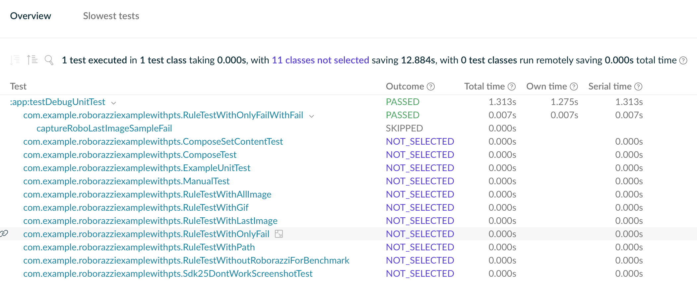

## Example Predictive Test Selection with Roborazzi

### Usage
`settings.gradle`:
```kotlin
plugins {
    id("com.gradle.common-custom-user-data-gradle-plugin") version "<latest-version>"
    id("com.gradle.enterprise") version <latest-version>"
}

gradleEnterprise {
    server = "$DV_URL"
    buildScan {
        publishAlways()
        capture {
            isTaskInputFiles = true
        }
        isUploadInBackground = System.getenv("CI") == null
    }
}
```

Root project `build.gradle.kts`:
```kotlin
allprojects {
    tasks.withType<Test>().configureEach {
        useJUnitPlatform()
        predictiveSelection {
            enabled.set(true)
        }
    }
}
```

Additional dependencies in the app module:
```kotlin
testRuntimeOnly("org.junit.vintage:junit-vintage-engine:<latest-version>")
```
### Tests
The tests used in this repository are the same used by the `sample-android` module in the Roborazzi repository:
```kotlin
@RunWith(AndroidJUnit4::class)
@GraphicsMode(GraphicsMode.Mode.NATIVE)
class RuleTestWithPath {
  @get:Rule
  val roborazziRule = RoborazziRule(
    captureRoot = onView(isRoot()),
    options = Options(
      captureType = RoborazziRule.CaptureType.LastImage(),
      outputDirectoryPath = "$DEFAULT_ROBORAZZI_OUTPUT_DIR_PATH/custom_outputDirectoryPath",
      outputFileProvider = { description, directory, fileExtension ->
        File(
          directory,
          "custom_outputFileProvider-${description.testClass.name}.${description.methodName}.$fileExtension"
        )
      },
      roborazziOptions = RoborazziOptions(
        compareOptions = RoborazziOptions.CompareOptions(
          outputDirectoryPath = "$DEFAULT_ROBORAZZI_OUTPUT_DIR_PATH/custom_compare_outputDirectoryPath",
        )
      )
    ),
  )

```

### Results
#### CI Build with tests skipped

Build scan: https://ge.solutions-team.gradle.com/s/jfagqexif3huw/tests/overview


